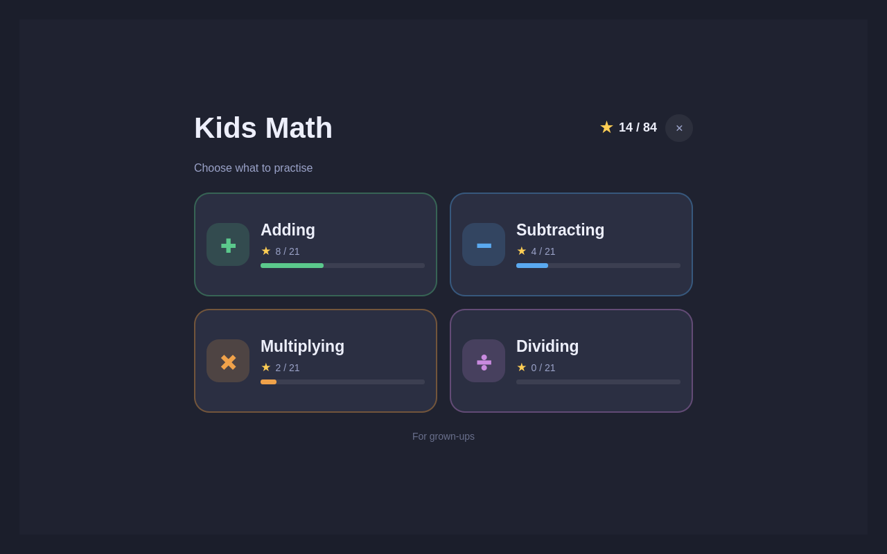
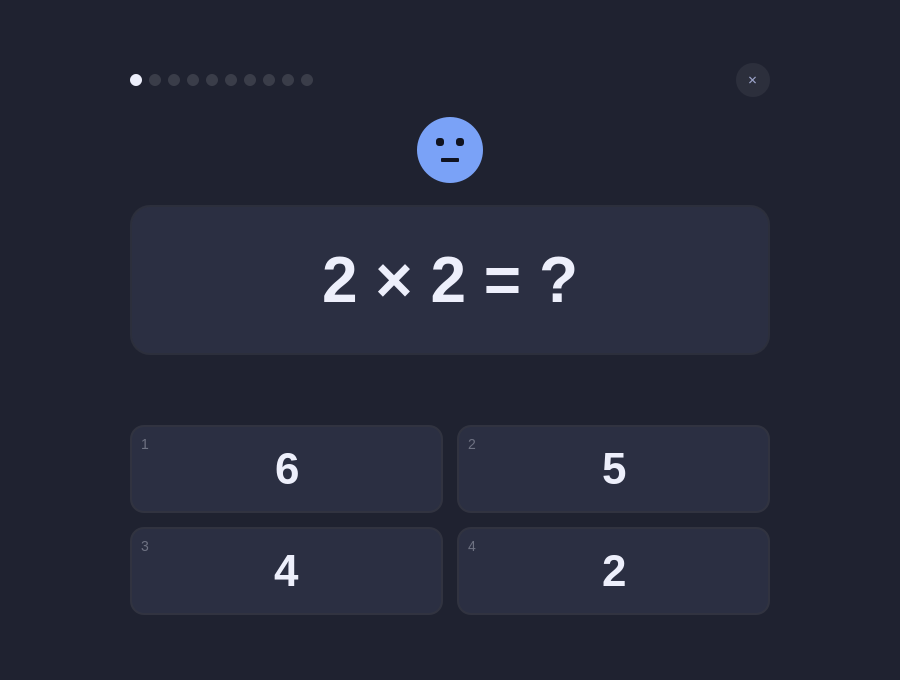
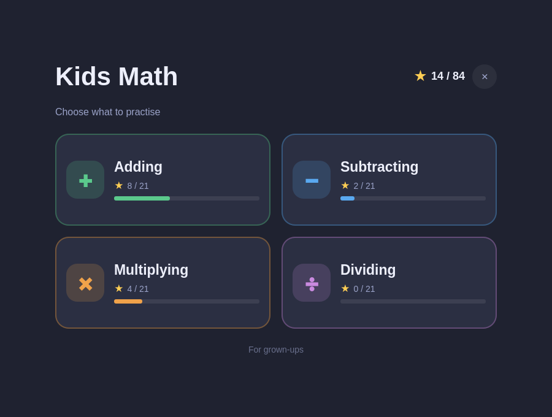
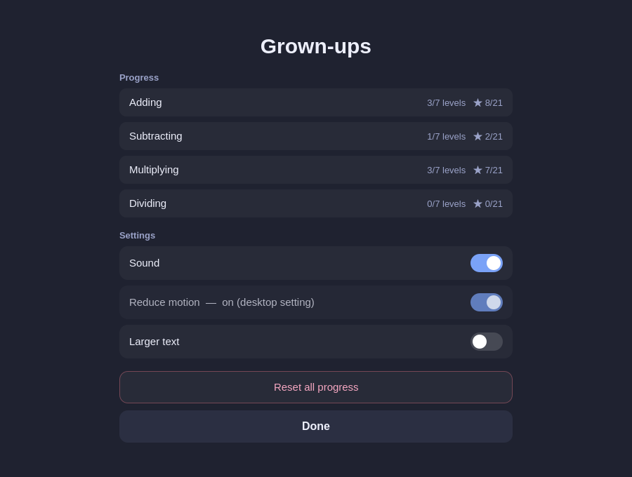

# Kids Math

A fun, progression-based math game for kids ages **5–12**, built as an
[Omarchy](https://omarchy.org) (Quattro) shell plugin. Add, subtract, multiply,
and divide across four colourful "worlds", each with unlockable levels and star
ratings.



## What's in it

- **Four worlds** — Adding, Subtracting, Multiplying, Dividing — 7 levels each.
- **A real difficulty ladder** per world: sums to 5 → carrying → three numbers;
  times tables → two-digit; division facts → bigger numbers. Division always has
  whole-number answers.
- **Stars & unlocking** — 10 questions a round; 3 stars for a clean sweep, 2 for
  ≥ 80%, 1 for ≥ 60%. The next level opens at 2 stars.
- **Gentle** — a friendly mascot, big tappable answers, confetti for a right
  answer, and *no scary red X* — a miss just shows the correct answer and moves
  on. No countdown timer.
- **Full keyboard support** — `1`–`4` to answer, arrows + Enter, `Esc` to back
  out.
- **Grown-ups area** (behind a press-and-hold) — progress per world, toggles for
  sound / reduced motion / larger text, and "reset all progress".
- **Theme-aware** — surfaces follow your Omarchy theme; the world and feedback
  colours stay bright and colour-blind-friendly.
- **Progress is saved** to `~/.local/state/omarchy/plugins/io.github.elynch303.kids-math/progress.json`.

|  |  |
|---|---|
|  |  |
|  |  |

## Install

```bash
omarchy plugin add https://github.com/elynch303/omarchy-math.git
omarchy plugin enable io.github.elynch303.kids-math
```

This adds a small **123** button to your bar. You can also:

- **Keybinding** — bind a key to
  `omarchy-shell shell toggle io.github.elynch303.kids-math`
- **App launcher** — copy the bundled launcher:
  ```bash
  cp ~/.config/omarchy/plugins/io.github.elynch303.kids-math/extras/kids-math.desktop \
     ~/.local/share/applications/
  ```

### Suggested Hyprland window rules

The game is a normal floating window. To have it open centred and sized:

```
windowrulev2 = float,  class:^(org\.quickshell)$, title:^(Kids Math)$
windowrulev2 = center, class:^(org\.quickshell)$, title:^(Kids Math)$
windowrulev2 = size 900 700, class:^(org\.quickshell)$, title:^(Kids Math)$
```

## Remove

```bash
omarchy plugin remove io.github.elynch303.kids-math
rm -rf ~/.local/state/omarchy/plugins/io.github.elynch303.kids-math   # deletes saved progress
rm -f ~/.local/share/applications/kids-math.desktop                   # if you added it
```

## Development

Requires the Qt **6** tools (`/usr/bin/qml6`, `/usr/lib/qt6/bin/qmllint`).

```bash
node dev/tests/run.mjs      # ~109k assertions over the problem generators & progression
bash dev/check.sh           # tests + qmllint + a headless run that fails on QML errors
/usr/bin/qml6 dev/harness.qml            # play it in a plain window, no shell needed
bash dev/sync.sh            # copy into ~/.config/omarchy/plugins/ for the running shell
```

The game logic (`Game.qml` + `ui/` + `logic/`) has **no** Quickshell dependency
— `Panel.qml` is the only shell-facing file, wrapping it in a `FloatingWindow`
and mapping theme tokens. `logic/*.js` are dual QML/Node modules.

## Roadmap

- Sound effects (the toggle exists; audio isn't wired yet)
- On-screen number pad for the higher levels
- Multiple child profiles

## License

MIT — see [`LICENSE`](LICENSE). Not affiliated with the Omarchy project.
